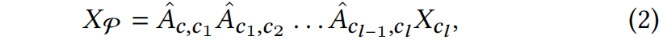
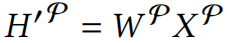
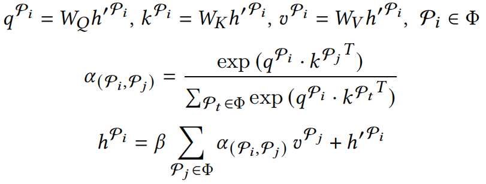
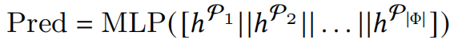

# SeHGNN
论文笔记&amp;复现：SeHGNN, 2022, arXiv。

# 论文笔记

## 简介

提出了一种新的==基于元路径==的HGNN。

* 作者发现同一种关系下的==node-level attention是不需要的==，用mean即可。于是作者移除了训练阶段的neighbor aggregation，放在了预处理步骤，这样==只需一次neighbor aggregation==。
* 提出一种新的==transformer-based semantic aggregator==来聚合不同元路径的不同语义信息。

## 方法论

### 第一部分：Simplified Neighbor Aggregation

对于异构图中每个结点，通过==mean==聚合其==基于元路径的邻居==的特征，得到该结点基于该元路径的表征：

其中，$p_{i, ..., j}$表示元路径$P$的一个实例，从结点$i$到结点$j$。

为了简化这步操作，采用==邻接矩阵的累乘==来计算semantic feature matrices。具体地，记$X_c$为结点类型为$c$的所有结点的原始特征构成的矩阵，$\hat{A}_{c, c_1}$表示从结点类型$c$到结点类型$c_1$的==邻接矩阵的row-normalized==形式，则==简化后的邻居聚合==过程为：

其中，$P = c c_1 c_2 ... c_l$是一条长度为$l+1$的元路径。

### 第二部分：Multi-layer Feature Projection

不同的元路径采用不同的矩阵变换：

### 第三部分：Transformer-based Semantic Aggregation

通过上述步骤，假设有$K$条元路径，为每个结点生成$K$个表征$\{ h'^{P_1}, ..., h'^{P_K} \}$。然后通过Transformer聚合这$K$个表征：

### 其他训练技巧

#### Metapath-based label propagation

将结点标签信息纳入邻居聚合过程。

#### General metapath selection

预先定义元路径的最大长度，然后选取范围内的所有元路径。

#### Multi-stage training

TODO

# 论文复现

TODO
